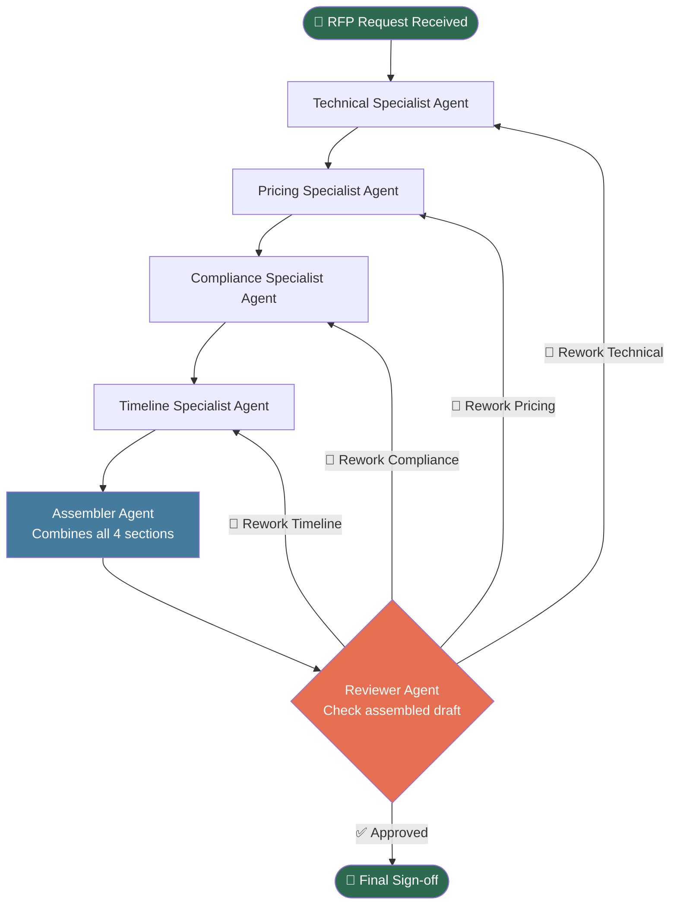
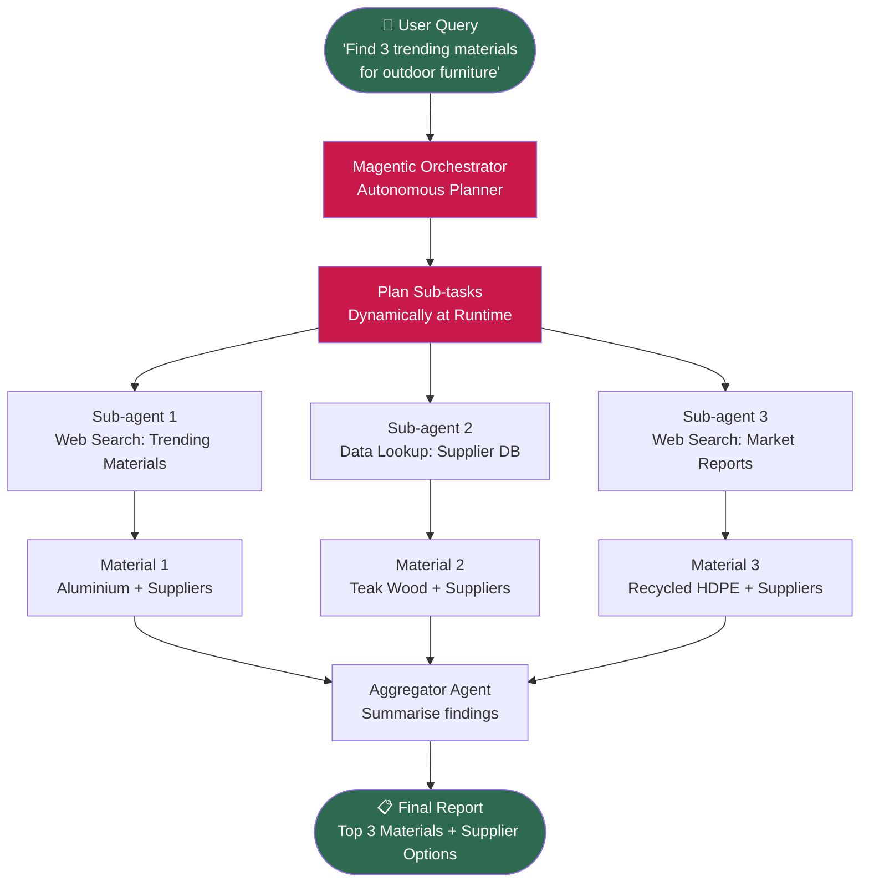
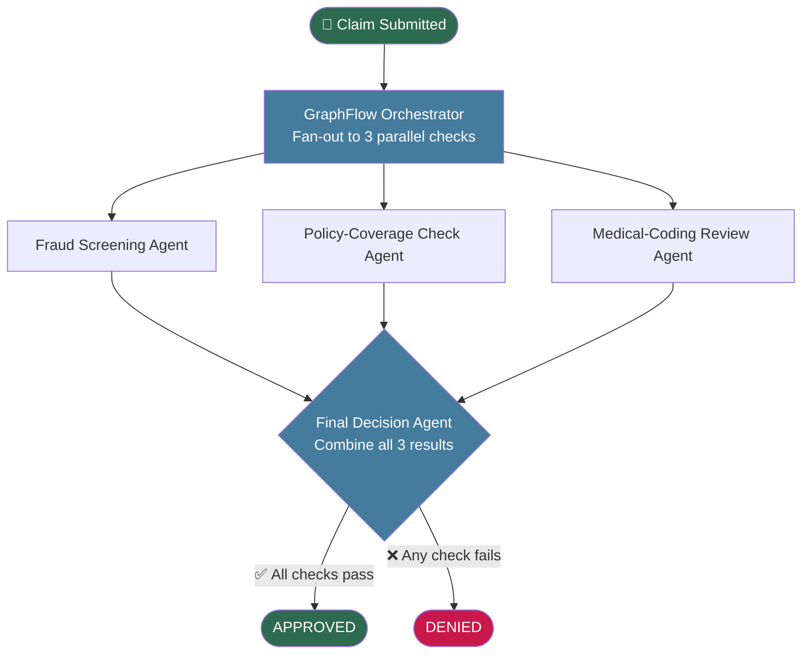

# Multi-Agent Orchestration Patterns — Scenario Analysis

> **Exercise:** EY GDS | AI & Data with Claude Code  
> **Task:** For each scenario, select the best orchestration pattern, justify the choice, and draw a block diagram.

---

## Pattern Reference Guide

| Pattern | Description | Best When |
|---|---|---|
| 🔵 **Round-robin** | Each agent takes a turn in a fixed cycle | Simple load balancing, homogeneous tasks |
| 🟢 **Selector** | A router/LLM picks which agent to call | Dynamic routing based on task type |
| 🟣 **Swarm / Handoff** | Agents hand off dynamically to each other | Conversational flows, uncertain next step |
| 🟠 **GraphFlow** | DAG-based; nodes run in dependency order | Known steps, parallel work, structured pipelines |
| 🔴 **Magentic** | Fully autonomous planning + tool use | Unknown sub-tasks, open-ended research |

---

## Scenario 1 — Manufacturing: RFP Response Builder

### Problem Statement
> A bid response has four sections (technical, pricing, compliance, timeline), each owned by a specialist and assembled in order. A reviewer then checks the assembled draft and may send specific sections back for rework before final sign-off.

### ✅ Selected Pattern: GraphFlow (🟠)

### Justification
| Criterion | Reasoning |
|---|---|
| **Known structure** | All four sections and their owners are defined upfront — no dynamic discovery needed |
| **Sequential assembly** | Sections must be completed in order before assembly can happen |
| **Conditional rework loop** | The reviewer's ability to send sections back creates a feedback edge in the graph |
| **Final gate** | A terminal sign-off node is a natural DAG termination point |
| **Why NOT Swarm** | Swarm handles dynamic handoffs; here the routing logic is deterministic |
| **Why NOT Magentic** | No open-ended task planning needed; scope is fully known |

### 🥈 Runner-up: Swarm / Handoff
Agents could hand off sections sequentially, but Swarm lacks native support for structured rework loops and a final gate node.

### Block Diagram



**ASCII fallback:**
```
[RFP Request]
      │
      ▼
[Technical Agent] ──────────────────────────────────────┐
      │                                                  │ rework
      ▼                                                  │
[Pricing Agent] ─────────────────────────────────────┐  │
      │                                               │  │
      ▼                                               │  │
[Compliance Agent] ───────────────────────────────┐  │  │
      │                                            │  │  │
      ▼                                            │  │  │
[Timeline Agent] ──────────────────────────────┐  │  │  │
      │                                         │  │  │  │
      ▼                                         │  │  │  │
[Assembler Agent]                               │  │  │  │
      │                                         │  │  │  │
      ▼                                         │  │  │  │
[Reviewer Agent] ──── rework ───────────────────┘──┘──┘──┘
      │
      ▼ approved
[Final Sign-off ✅]
```

---

## Scenario 2 — Retail: Buyer's Research Assistant

### Problem Statement
> A merchandising team asks: "Find three trending materials for outdoor furniture this season and summarise supplier options." The number and type of sub-tasks isn't known in advance and may need web search and data lookups.

### ✅ Selected Pattern: Magentic (🔴)

### Justification
| Criterion | Reasoning |
|---|---|
| **Unknown sub-task count** | "Three trending materials" requires autonomous discovery — agent must decide how many searches to run |
| **Dynamic tool use** | Web search + data lookups needed; tools are invoked adaptively, not in a fixed sequence |
| **Open-ended planning** | The agent must decompose the high-level goal into sub-tasks at runtime |
| **Self-directed orchestration** | Magentic's autonomous planner creates and schedules sub-agents dynamically |
| **Why NOT Selector** | Selector routes to known, pre-defined agents; here the task space is not predefined |
| **Why NOT GraphFlow** | No fixed DAG; the graph is constructed on the fly based on what is discovered |

### 🥈 Runner-up: Selector
A Selector could route between a "web search tool" and a "database lookup tool", but it cannot autonomously determine how many materials to research or self-plan the supplier summary step.

### Block Diagram



**ASCII fallback:**
```
[User Query: "Find trending outdoor furniture materials"]
      │
      ▼
[Magentic Orchestrator — Autonomous Planner]
      │
      ▼  (plans dynamically at runtime)
  ┌───┴──────────────────┬──────────────────┐
  │                      │                  │
  ▼                      ▼                  ▼
[Sub-agent 1:       [Sub-agent 2:      [Sub-agent 3:
 Web Search          Supplier DB        Market Reports
 Trending Mats]      Lookup]            Web Search]
  │                      │                  │
  ▼                      ▼                  ▼
[Material 1 +       [Material 2 +      [Material 3 +
 Suppliers]          Suppliers]         Suppliers]
  │                      │                  │
  └──────────────────────┴──────────────────┘
                          │
                          ▼
               [Aggregator Agent]
                          │
                          ▼
          [Final Report: 3 Materials + Supplier Summary ✅]
```

---

## Scenario 3 — Insurance: Claims Adjudication

### Problem Statement
> A claim needs three independent checks — fraud screening, policy-coverage check, and medical-coding review — that can run at the same time. A final decision agent then combines all three results into an approve or deny.

### ✅ Selected Pattern: GraphFlow (🟠)

### Justification
| Criterion | Reasoning |
|---|---|
| **Parallel execution** | All three checks are independent and can run simultaneously — GraphFlow supports fan-out to parallel nodes |
| **Fixed, known structure** | The three check types are predefined; no dynamic discovery |
| **Fan-in aggregation** | A final decision node collects all three results — classic DAG fan-in pattern |
| **Deterministic flow** | No conditional branching mid-flow; just parallel → merge → decide |
| **Why NOT Round-robin** | Round-robin is sequential and load-balanced, not parallel |
| **Why NOT Swarm** | Swarm is for sequential handoffs; cannot natively fan-out to parallel agents |

### 🥈 Runner-up: Swarm / Handoff
If checks were sequential (one result informs the next), Swarm would be appropriate. But since they are explicitly independent and parallel, GraphFlow is the right fit.

### Block Diagram



**ASCII fallback:**
```
[Claim Submitted]
       │
       ▼
[GraphFlow Orchestrator — Fan-out]
       │
  ┌────┴────────────────┬──────────────────┐
  │                     │                  │
  ▼                     ▼                  ▼
[Fraud             [Policy-Coverage   [Medical-Coding
 Screening          Check Agent]       Review Agent]
 Agent]
  │                     │                  │
  └─────────────────────┴──────────────────┘
                         │
                         ▼  (fan-in)
              [Final Decision Agent]
                         │
               ┌─────────┴─────────┐
               ▼                   ▼
          [APPROVED ✅]        [DENIED ❌]
```

---

## Summary Table

| # | Domain | Use Case | Pattern | Runner-up | Key Reason |
|---|---|---|---|---|---|
| 1 | Manufacturing | RFP Response Builder | 🟠 **GraphFlow** | 🟣 Swarm/Handoff | Fixed DAG + conditional rework loop + final gate |
| 2 | Retail | Buyer's Research Assistant | 🔴 **Magentic** | 🟢 Selector | Unknown sub-tasks + dynamic tool use + autonomous planning |
| 3 | Insurance | Claims Adjudication | 🟠 **GraphFlow** | 🟣 Swarm/Handoff | Parallel fan-out + fan-in aggregation + fixed structure |

---

## Decision Framework (Quick Reference)

```
Is the task structure fully known upfront?
├── YES → Are steps parallel or have complex dependencies?
│         ├── YES → 🟠 GraphFlow
│         └── NO  → Are steps sequential with dynamic routing?
│                   ├── YES → 🟢 Selector
│                   └── NO  → Simple cycle? → 🔵 Round-robin
└── NO  → Does the agent need to self-plan sub-tasks dynamically?
          ├── YES → 🔴 Magentic
          └── NO  → Is context passed between agents conversationally?
                    └── YES → 🟣 Swarm / Handoff
```

---

